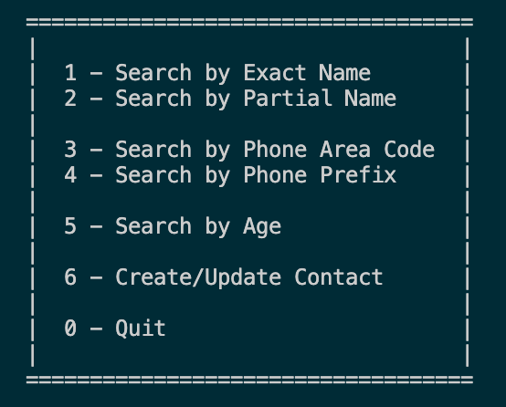
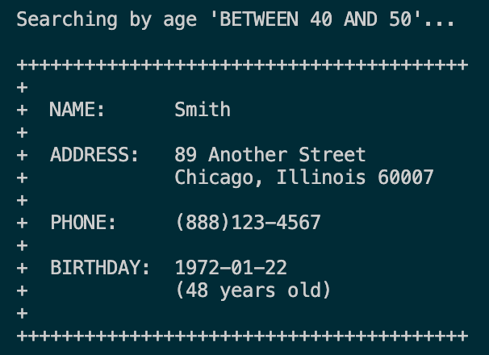

# DatabaseAddressBook
A python console application that uses a MySQL database to manage a simple
address book.

* [Using the Program](./README.md#using-the-program)
  * [Search by Last Name](./README.md#search-by-last-name)
  * [Search by Phone Prefix](./README.md#search-by-phone-prefix)
  * [Search by Age Range](./README.md#search-by-age-range)
  * [Add or Update Person](./README.md#add-or-update-person)
* [Installation](./README.md#installation)
  * [Requirements](./README.md#requirements)
  * [Setup](./README.md#setup)

# Using the Program

Run the progrm by cloning or downloading this repository, then navigating to
the directory where the file resides.

Then, execute the program:

```python
./program.py
```

You will be presented with a menu that you can use to select your options for
interacting with the address book.



Type your menu choice and follow the steps to interact with the program.

## Search by Name

If a result is not found, the application will alert you.


Additionally, the search is not case-sensitive.


If you choose to search by partial name, you can enter any part of the name
and see any matching results.


## Search by Phone Number

If multiple records match your search criteria, you will see all results
printed to the console.


## Search by Age Range



## Add or Update Person

When you choose to create or update a contact, the system will check to see if
a person by that name already exists.

If not, a new person will be created and then displayed.


If the person does exist, the address store will be updated to end the range of
living at the previous addres, will add a new address, and will then link the
user to the new address. The phone number will also be updated.


_Note: The birthday will be ignored on updates._

-----

# Installation

## Requirements

* [Install MySQL](https://dev.mysql.com/downloads/mysql/)
* [Install PyMySQL](https://pymysql.readthedocs.io/en/latest/user/installation.html)
  * Include the dependency for “sha256_password” authentication.

## Setup

Run the seed file to set up your database in MySQL.

* [`MySQL/create.sql`](./MySQL/create.sql)

You can use the SELECT statements in `joinActive.sql` or `joinAll.sql` from
[the same folder](./MySQL) to confirm that you've loaded your data.
