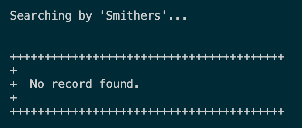
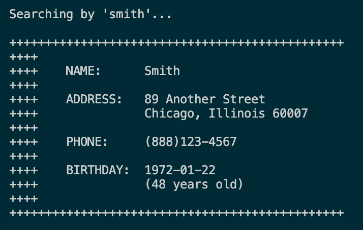

# DatabaseAddressBook
A python console application that uses a MySQL database to manage a simple
address book.

* [Using the Program](./README.md#using-the-program)
  * [Search by Last Name](./README.md#search-by-last-name)
  * [Search by Phone Prefix](./README.md#search-by-phone-prefix)
* [Installation](./README.md#installation)
  * [Requirements](./README.md#requirements)
  * [Setup](./README.md#setup)

# Using the Program

Run the progrm by cloning or downloading this repository, then navigating to
the directory where the file resides.

Then, execute the program:

```python
./program.py
```

You will be presented with a menu that you can use to select your options for
interacting with the address book.


Type your menu choice and follow the steps to interact with the program.

## Search by Last Name

If a result is not found, the application will alert you.



Additionally, the search is not case-sensitive.



## Search by Phone Prefix

If multiple records match your search criteria, you will see all results
printed to the console.


# Installation

## Requirements

* [Install MySQL](https://dev.mysql.com/downloads/mysql/)
* [Install PyMySQL](https://pymysql.readthedocs.io/en/latest/user/installation.html)
  * Include the dependency for “sha256_password” authentication.

## Setup

Run the seed file to set up your database in MySQL.

* [`MySQL/create.sql`](./MySQL/create.sql)

You can use the SELECT statements in `joinActive.sql` or `joinall.sql` from
[the same folder](./MySQL) to confirm that you've loaded your data.
